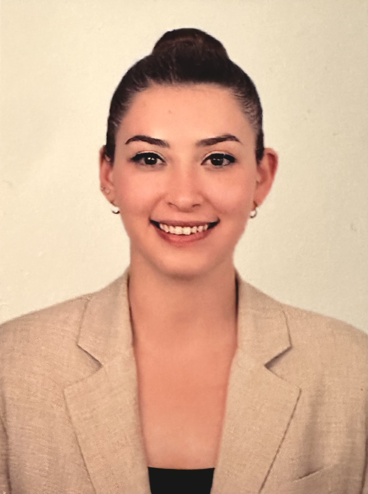

{fig-align="center" width="225"}

<h1 style="color:darkblue;">

Eğitim

</h1>

-   Yüksek Lisans, Mühendislik Yönetimi, Hacettepe Üniversitesi, 2026 - Devam Ediyor
-   Lisans, İktisat, Uludağ Üniversitesi, 2013 - 2018

<h1 style="color:darkblue;">

İş Tecrübesi

</h1>

<h4 style="color:blue;">

Employements

</h4>

-   **Megart Teknoloji San. Tic. A.Ş.**

    Üretim Planlama ve Satın Alma Müdürü (Ekim 2025 - Devam Ediyor) Satın Alma Uzmanı (Ağustos 2023 - Ekim 2025)

-   **Mebant İzolasyon ve Bant San. A.Ş.**

    Sistem ve Süreç Geliştirme Yöneticisi (Ocak 2023 - Ağustos 2023) Sistem ve Süreç Geliştirme Uzmanı (Kasım 2021 - Aralık 2022)

-   **Billas Lastik ve Kauçuk San. Tic. A.Ş.**

    Kalite Yönetim Sistemleri Sorumlusu (Eylül 2018 - Kasım 2021

<h2 style="color:blue;">

Internships

</h2>

-   **Türk Pirelli Lastikleri A.Ş.**

    İnsan Kaynakları Stajyeri (Ağustos 2016 - Eylül 2016)

<h1 style="color:darkblue;">

# Sertifikalar

</h1>

-   **MMOG/LE V.6**  Ford Motor Company

-   **IATF 16949:2016 Otomotiv Kalite Yönetim Sistemleri – Bilgilendirme Eğitimi**  (Sertifika No: 2023028) – Redline Denetim & Eğitim Hizmetleri

-   **ISO 19011 İç Tetkikçi Sertifikası**  (Sertifika No: 2023048) – Redline Denetim & Eğitim Hizmetleri

-   **AIAG & VDA FMEA V1**  (Sertifika No: 2023001) – Redline Denetim & Eğitim Hizmetleri

-   **VDA 6.3 Proses İç Tetkikçisi & VDA – Alman Otomotiv KYS Bilinç Eğitimi**  (Sertifika No: RIS25062022.02) – Redline Denetim & Eğitim Hizmetleri

-   **IATF 16949:2016 İPK Eğitimi (MSA 4th, SPC 2nd)**  (Sertifika No: RIS26072022.02) – Redline Denetim & Eğitim Hizmetleri

-   **ISO 14001:2015 Çevre Yönetim Sistemleri – Bilgilendirme Eğitimi**  (Sertifika No: 40079) – Gelişim Yönetim Sistemleri A.Ş.

-   **Sürdürülebilir Satın Alma** Demirci Eğitim & Danışmanlık

-   **A’dan Z’ye Etkili İletişim**  (Sertifika No: UC-YSB2O31W) – Udemy

-   **Kaizen – Değişim ve Sürekli İyileştirme**  (Sertifika No: 2866) – Elginkan Vakfı

# Publications

1.  Dasdemir, E., Batta, R., Koksalan, M., Tezcaner Ozturk, D. (2022) “UAV Routing for Reconnaissance Mission: A Multi-Objective Orienteering Problem with Time-Dependent Prizes and Multiple Connections”, Computers & Operations Research, 145: 105882.

# Competencies

R, Quarto, Git, Python

# Hobbies

<h2 style="color:darkgreen;">

Başlık

</h2>
